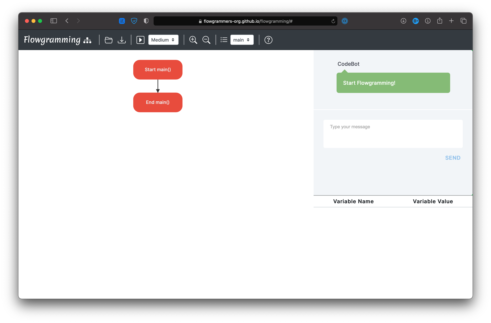

# Flowgramming

**Flowgramming** is a platform-independent graphical authoring tool which allows users
to draw and execute programs using flowcharts.

**Why Flowgramming?**

For the novice programmer, it is usually difficult to de-link the programming logic from the syntax of the programming language. This often leads to students memorizing code rather than understanding the logic and designing solutions. Flowgramming was built in an effort for beginner and novice programmers to understand programming logic and develop algorithmic thinking & problem solving skills without the hassle of learning the code syntax.

This site serves as an user manual on how to use the Flowgramming web application.

**Features**

1. Easy and intuitive to understand and use
2. Platform Independent
3. Programming logic support (Condition,Loops,etc.)
4. Chat based input and output window
5. Arrays (1D and 2D)
6. Flexible expressions and all data types (including strings) supported
7. Dedicated variable watch window to see all variable changes
8. Specialized String Functions
9. Function watch window allows custom definition of multiple functions
10. Can Save and load all developed flowgrams (saved with extension ".fgmin")

# Maintained by

CORE Lab, Amrita Vishwa Vidyapeetham, Coimbatore.

# Mentor
- [Ritwik M](https://www.amrita.edu/faculty/m-ritwik)

# Contributors
- [Harshit Agarwal](https://www.linkedin.com/in/harshitagarwal1907/)
- [Rajkumar S](https://rajkumaar.co.in)
- [Sanjana G](https://www.linkedin.com/in/sanjana-gali-06a100166/)
- [Pranesh S](https://github.com/pranesh-sp)
- [Adithi Narayan](https://github.com/Tvashta)
- [Ganapathi](https://github.com/ganapathi12)
- [Vishvakar S](https://github.com/Vish-10)
