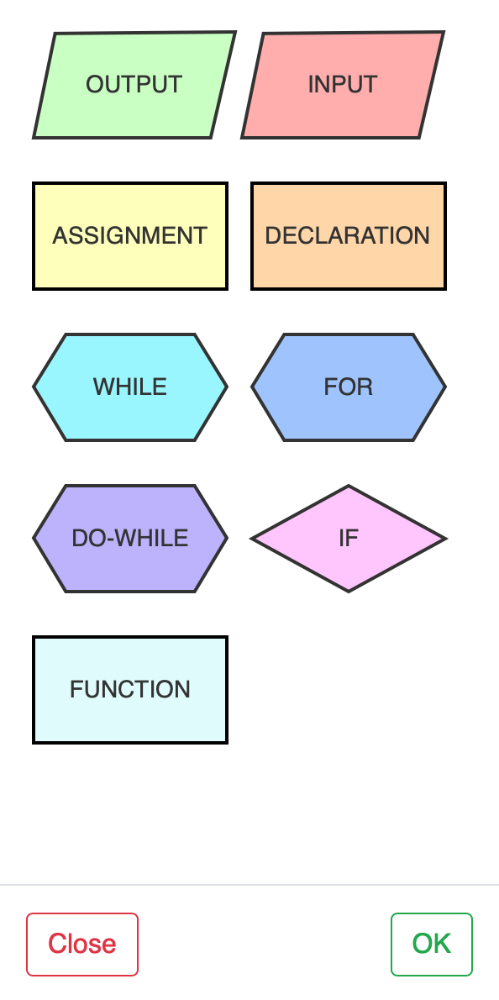
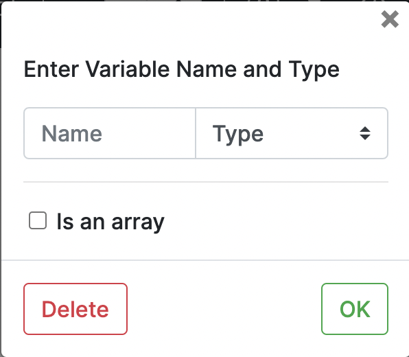

# How to create a block in Flowgramming?

- To add a block to the flowgram graph, you need to **double click** on the link (arrow).
- A pop up will appear where in you can choose the type of block you want to add.

- Select the block again to add the parameters
- Click ok to save the block.

