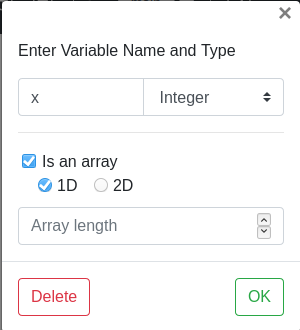

# Supported data types

- Integer
- Float
- Character
- String
- One dimensional and two-dimensional arrays

For selecting the data type, choose declaration block
and expand the datatype dropdown

If the variable needs to be an array, you will need to mark the
checkbox as shown in the picture, and choose the appropriate dimensions.

