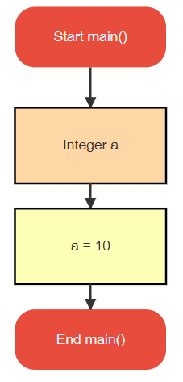
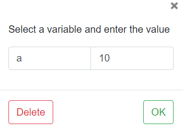

# Deleting a block

If you want to delete a block, first double-click on the block \[Say the assigment block\].

You will get a pop-up to edit the properties of the block, depending on its type. 
On the bottom left, a delete button is present. Click on it to delete the block.

Once clicked, you will see the block taken out of the flowgram.

