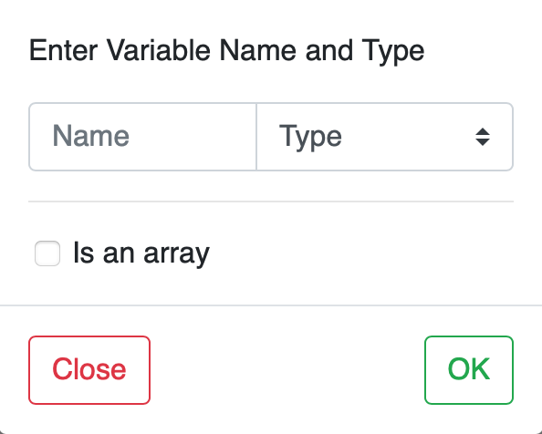
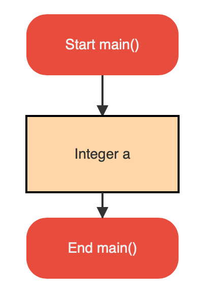

# Editing a block's properties

When you add a block to the graph, the next thing you would want to do is set some
properties on the block. For the same, you need to double-click on the block.

You will get a pop-up to edit the properties of the block, depending on its type.
For instance, if you double-click on a declaration block, you would see fields to enter the 
variable name, its type, and length if it is an array.

After entering the values, when you press **OK**, you will see the block updated
with its properties on the flowgram.

