# Examples
## 1. Add Two Numbers
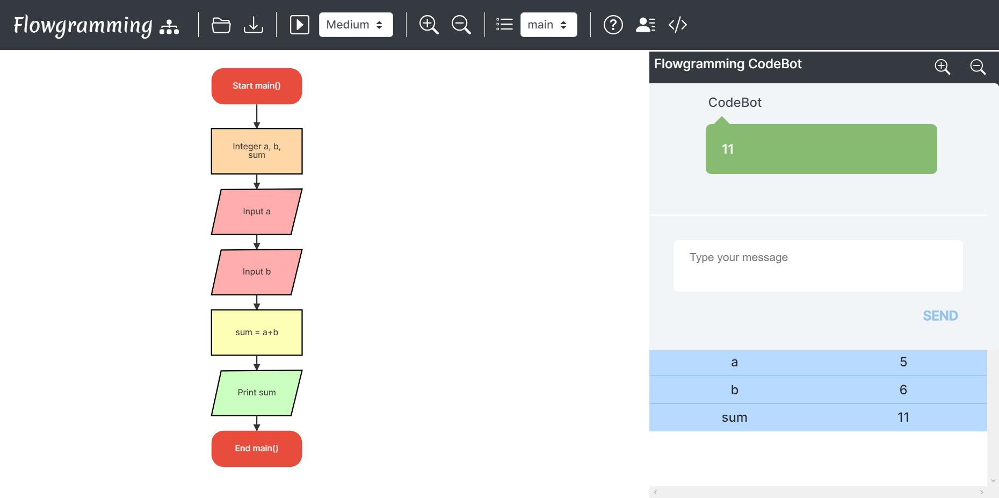

## 2. Subtract Two Numbers

## 3. Greater of Two Numbers

## 4. Are Two Numbers Equal
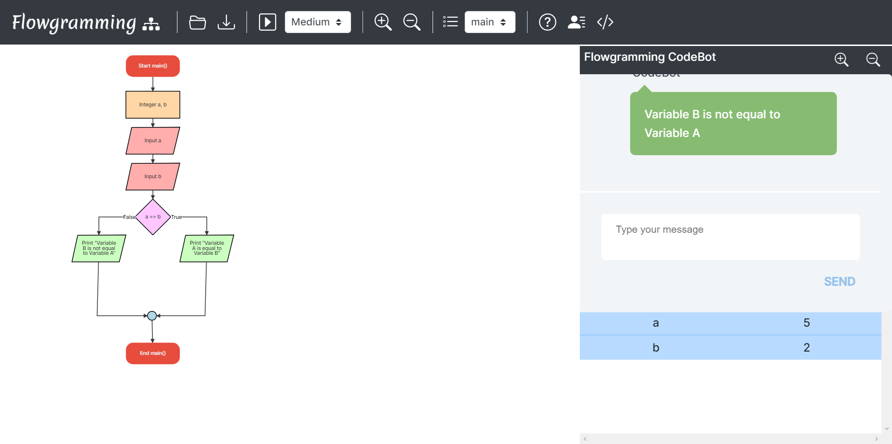

## 5. Sum of Array
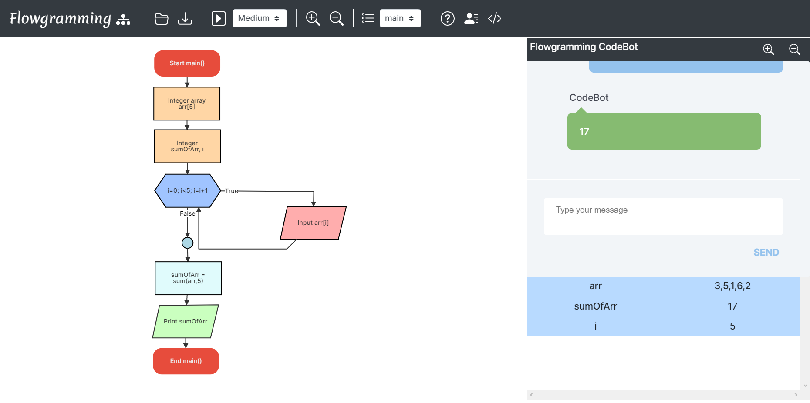
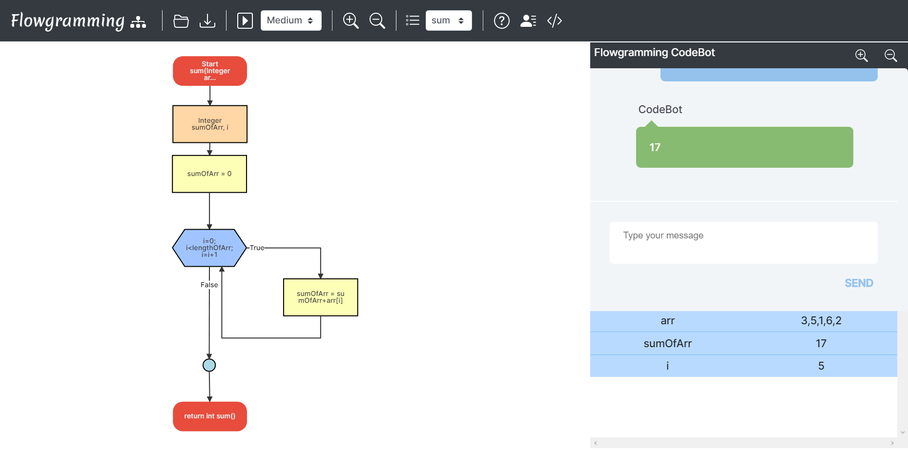

## 6. Function for Adding Two Numbers

## 7. Check if character exists in String
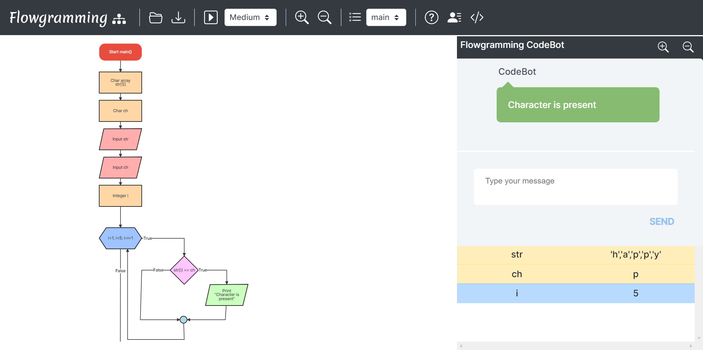

## 8. Recursion
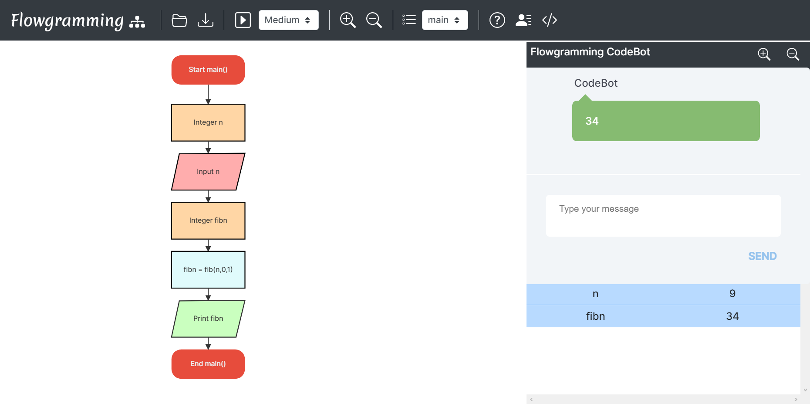

## 9. Loops
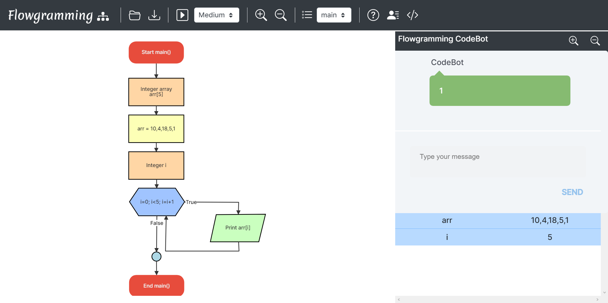
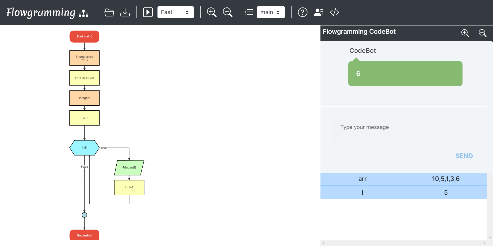
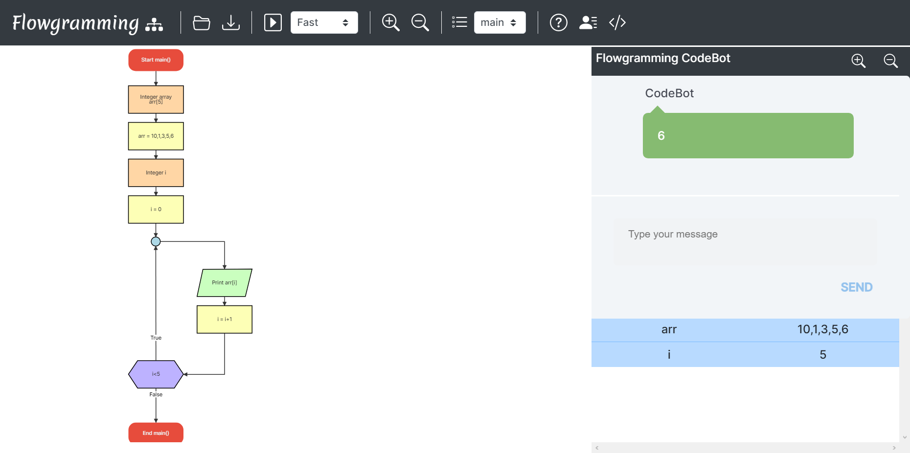

## 10. 1d Array
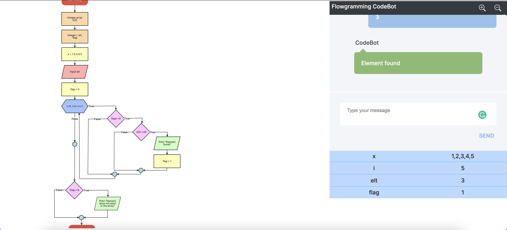

## 11. Math Functions
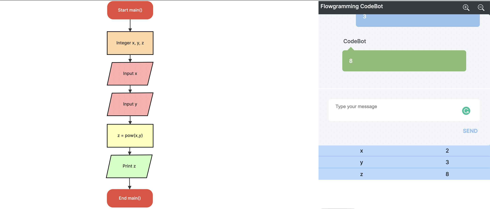
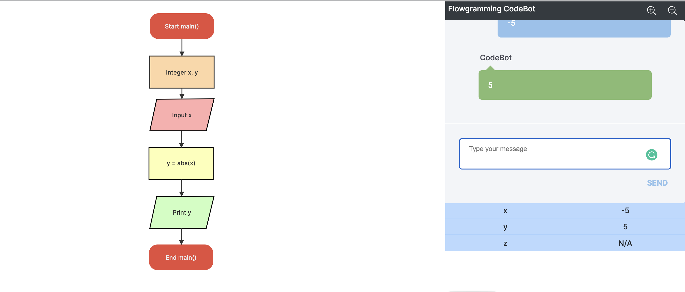

## 12. String Functions
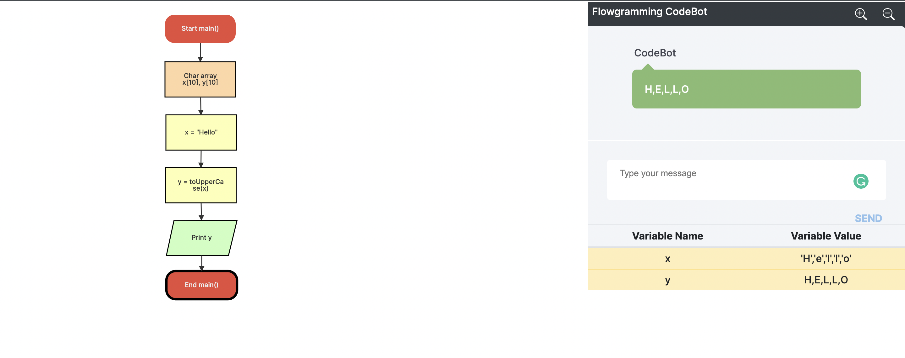
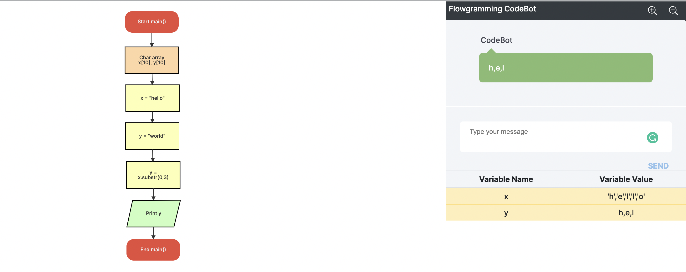

## 13. Pass and return 1D Array from Function

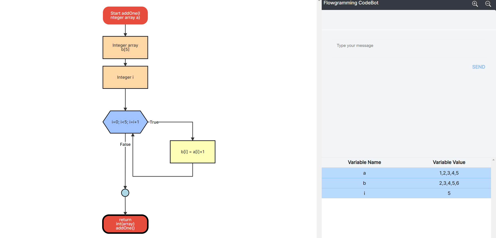