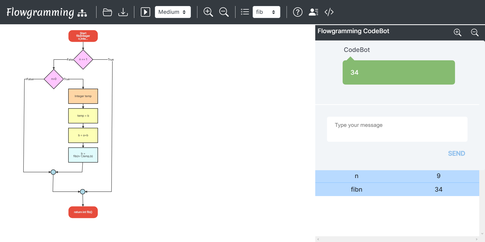

# Examples
## 1. Add Two Numbers

## 2. Subtract Two Numbers

## 3. Greater of Two Numbers

## 4. Are Two Numbers Equal

## 5. Sum of Array

## 6. Function for Adding Two Numbers

## 7. Check if character exists in String

## 8. Recursion

## 9. Loops

## 10. 1d Array

## 11. Math Functions

## 12. String Functions

