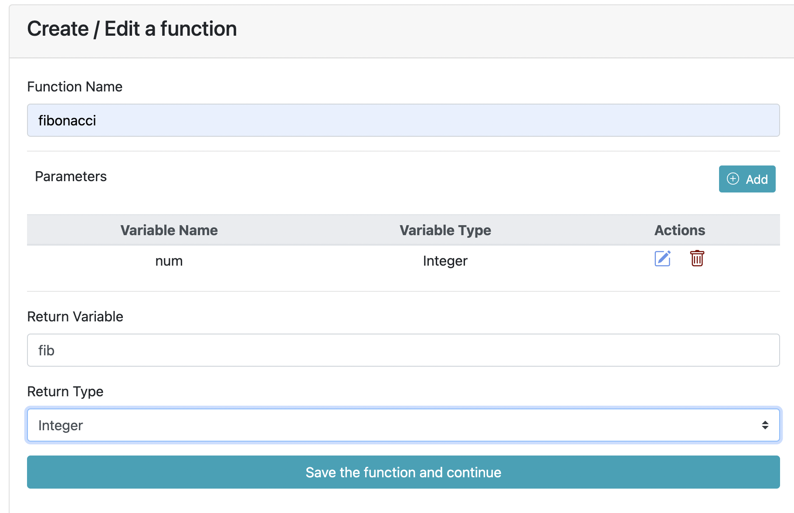
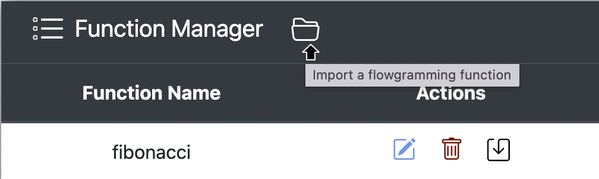
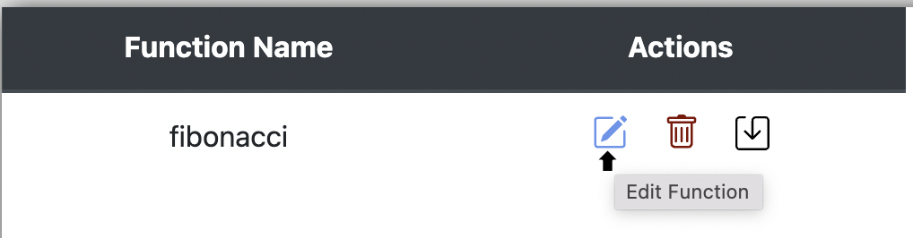
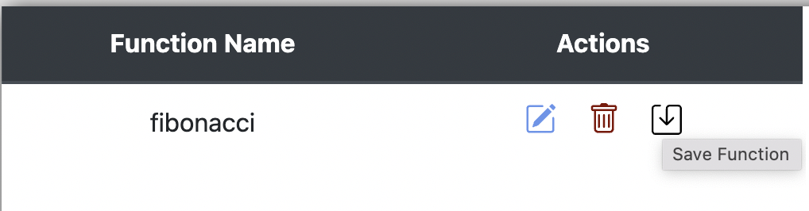
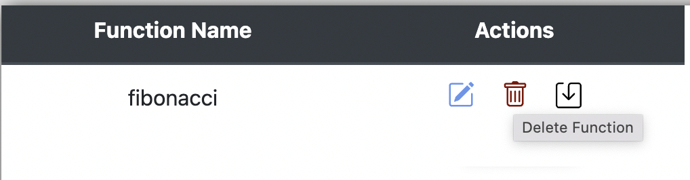

# User Defined Functions
    User defined functions need to be called only inside a Function block. 
    
1. **Manually Adding a Function**
   - Enter the name for the function.
   - Add multiple parameters by entering the variable name and variable type.
   - Enter the return variable and the variable type.
   - Save the function and continue.
     
     

2. **Uploading a Function**
    - Click the upload button to upload a pre-existing function.
    
    
    
3. **Updating a Function**
   - To update an existing function, click the edit button in the function manager.
   - Update the different parameters.
   - Save the function and continue.
     
     

4. **Downloading a Function**
    - Click the download button to download the function.
      
    
     
5. **Deleting a Function**
    - Click the delete button to delete an existing function.
      
    

