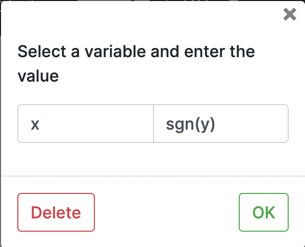
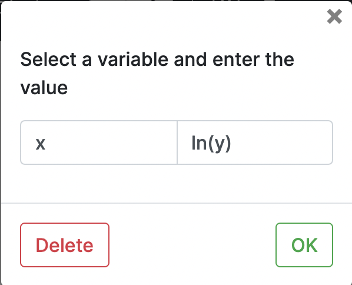
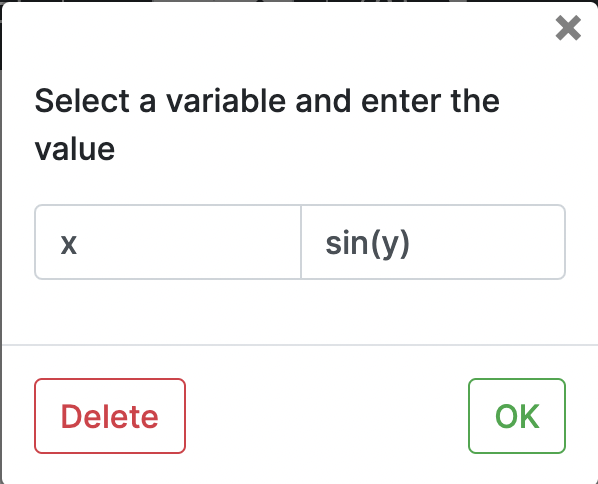
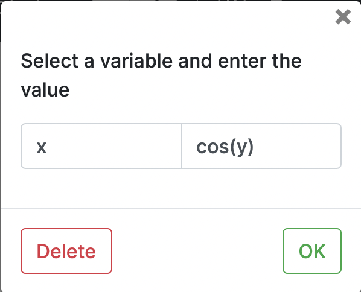
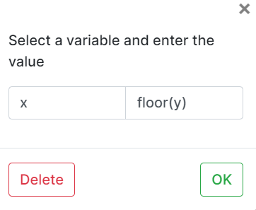
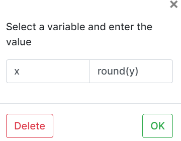
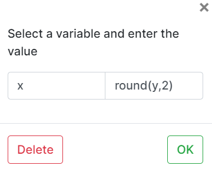

# In-built string functions

1. **Absolute**
   - Declare integers x, y
   - Take input for x, y  
   - Choose assignment block and write the code `x = abs(y)`
     
     
    
2. **Power**
    - Declare integers x,y and z
    - Take input for x, y
    - Choose assignment block and write the code `z = pow(x,y)`
      
      

3. **Square Root**
   - Declare integers x, y
   - Take input for x, y  
   - Choose assignment block and write the code `x = sqrt(y)`
     
     

4. **Signum**
    - Declare integers x, y
    - Take input for x, y  
    - Choose assignment block and write the code `x = sgn(y)`
     
     

5. **Natural Log**
    - Declare integers x, y
    - Take input for x, y  
    - Choose assignment block and write the code `x = ln(y)`
     
     

6. **Log**
    - Declare integers x,y and z
    - Take input for x, y
    - Choose assignment block and write the code `z = log(x,y)`
      
      

7. **Sin**      
   - Declare integers x, y
   - Take input for x, y  
   - Choose assignment block and write the code `x = sin(y)`
     
     

8. **Cos**  
   - Declare integers x, y
   - Take input for x, y  
   - Choose assignment block and write the code `x = cos(y)`
     
     

9. **Tan**
   - Declare integers x, y
   - Take input for x, y  
   - Choose assignment block and write the code `x = tan(y)`
     
     

10. **Arcsin**
   - Declare integers x, y
   - Take input for x, y  
   - Choose assignment block and write the code `x = arcsin(y)`
     
     

11. **Arccos**
   - Declare integers x, y
   - Take input for x, y  
   - Choose assignment block and write the code `x = arccos(y)`
     
     

12. **Arctan**
   - Declare integers x, y
   - Take input for x, y  
   - Choose assignment block and write the code `x = arctan(y)`
     
     

13. **Ceil**
   - Declare integer x, float y
   - Take input for x, y  
   - Choose assignment block and write the code `x = ceil(y)`
     
     

14. **Floor**
   - Declare integers x, float y
   - Take input for x, y  
   - Choose assignment block and write the code `x = floor(y)`
     
     

15. **Round**
   - Declare integers x, float y
   - Take input for x, y  
   - Choose assignment block and write the code `x = round(y)`
     
     
   - Second parameter denotes number of digits after floating point
     
     
