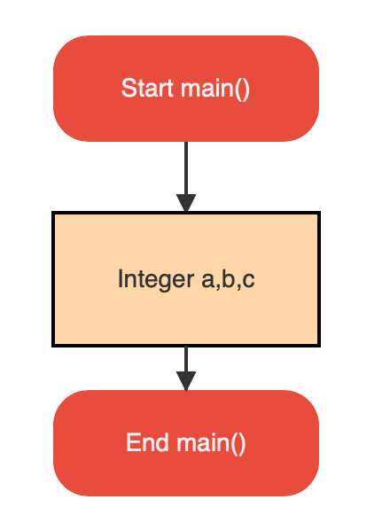

# Declaring multiple variables

If you would like to declare multiple variables of same type
in the same block, you need to use comma(`,`) to separate the variable names.

For example, declaring `a,b,c` of type `integer` will look like this.

And the flowgram will look like :

