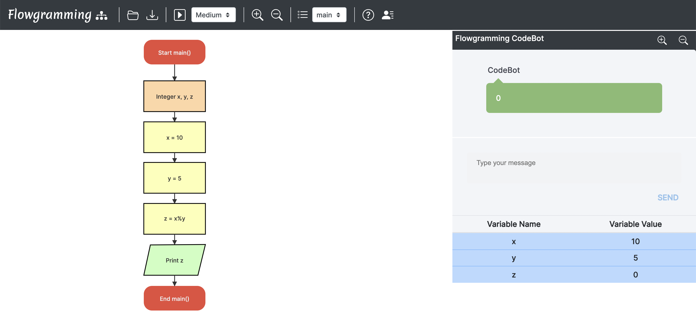

# Operators

Flowgramming supports different math operations such as '+', '-', '*', '/', '%'

1. The '+' operator
    - The '+' operator is used to perform the addition operation.
    - Declare three integers x,y and z.
    - Assign a value to x and y
    - Assign z = x+y
    - z contains the sum of x and y
    

2. The '-' operator
    - The '-' operator is used to perform the subtraction operation.
    - Declare three integers x,y and z.
    - Assign a value to x and y
    - Assign z = x-y
    - z contains the difference of x and y
    

3. The '*' operator
    - The '*' operator is used to perform the multiplication operation.
    - Declare three integers x,y and z.
    - Assign a value to x and y
    - Assign z = x*y
    - z contains the product of x and y
    

4. The '/' operator
    - The '/' operator is used to perform the division operation.
    - Declare three integers x,y and z.
    - Assign a value to x and y
    - Assign z = x+y
    - z contains the quotient of x/y
     

5. The '%' operator
    - The '%' operator is used to perform the modulus operation.
    - Declare three integers x,y and z.
    - Assign a value to x and y
    - Assign z = x%y
    - z contains the remainder of x/y
    

