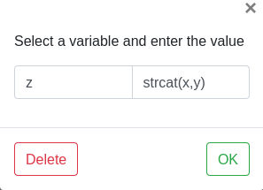
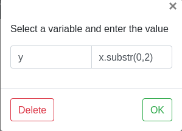
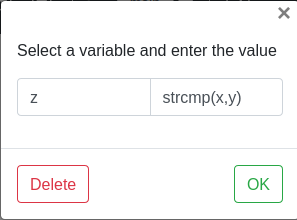
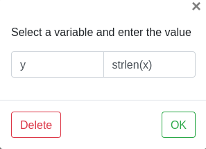
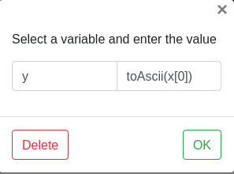
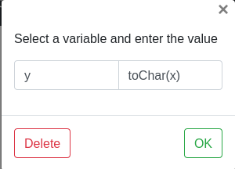
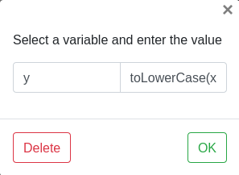
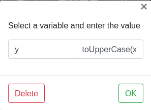

# In-built string functions

1. **String concatenation**
   - Declare strings x, y, z
   - Take input for x, y  
   - Choose assignment block and write the code `z = strcat(x,y)`
     
     
    
2. **Substring**
   - Declare strings x, y
   - Take input for x
   - Choose assignment block and write the code `y = x.substr(0,3)`
     
     
     
3. **String compare**
    - Declare strings x, y and integer z
    - Take input for x, y
    - Choose assignment block and write the code `z = strcmp(x,y)`
      
      
4. **String length**
    - Declare string x and integer y
    - Take input for x
    - Choose assignment block and write the code `y = strlen(x)`
      
      
5. **To Ascii**
    - Declare string x and integer y
    - Take input for x
    - Choose assignment block and write the code `y = toAscii(x[0])`
      
      
6. **To Char**      
   - Declare an integer x and character y
   - Take input for x
   - Choose assignment block and write the code `y = toChar(x)`
     
     
7. **To lower case**  
    - Declare strings x, y
    - Take input for x
    - Choose assignment block and write the code `y = toLowerCase(x)`
      
      
8. **To upper case**
   - Declare strings x, y
   - Take input for x
   - Choose assignment block and write the code `y = toUpperCase(x)`
     
           
