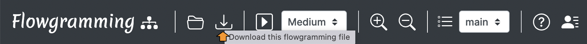
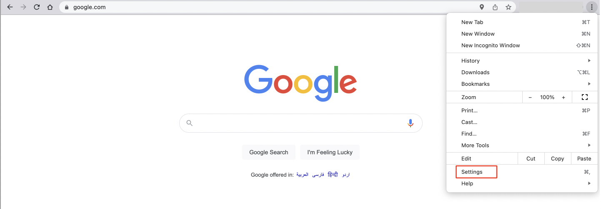
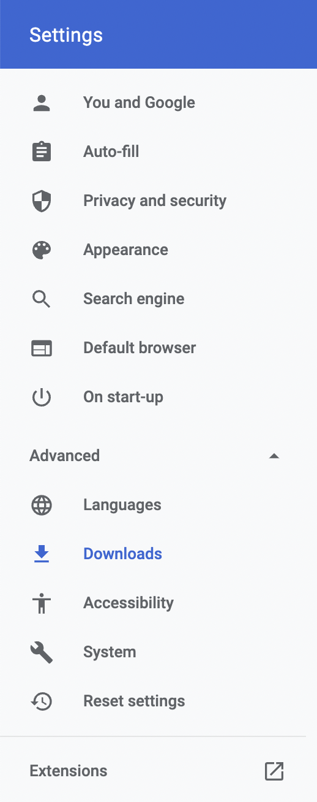
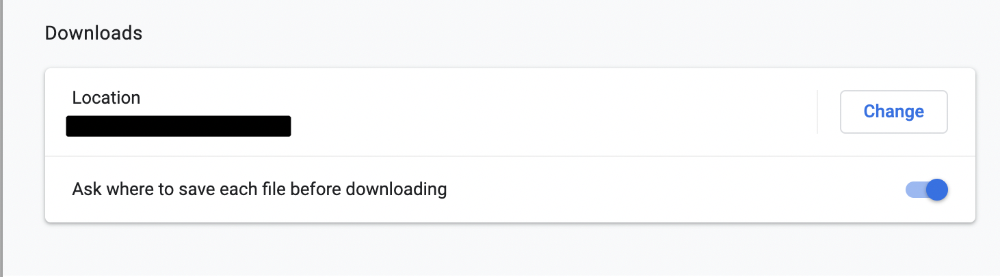
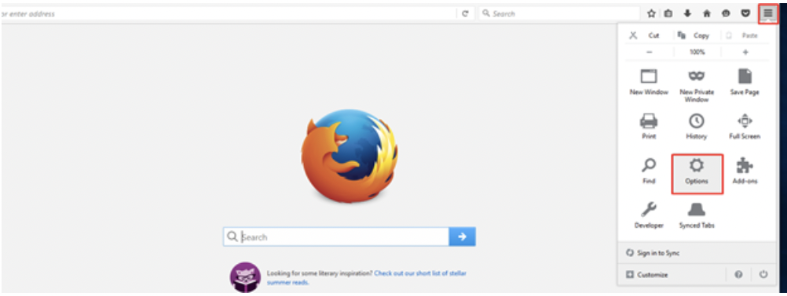
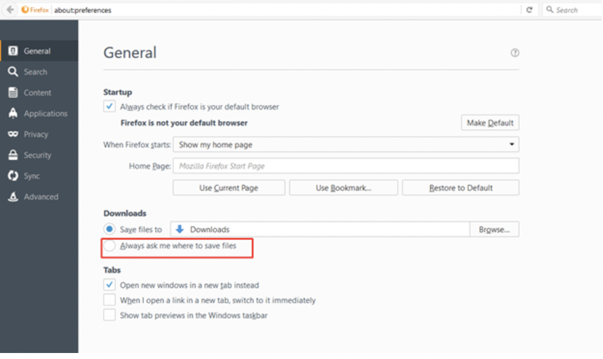

# Uploading an .fgmin file
The flowgramming application supports upload by clicking the upload button on the nav bar.

Select the '.fgmin' file of your preference to upload into the website.

# Downloading an .fgmin file

The flowgramming application supports download by clicking the download button on the nav bar.

By default, '.fgmin' files are untitled and will be saved as 'Untitled.fgmin'.
In order to save them by a different name, please follow the instructions as per your current browser.

1.	Google Chrome
    - Click on the icon on the top right corner and choose **Settings** from the dropdown list.
    
    - Click on **advanced settings**
     
    
    - This will expand the settings list. Scroll down to the **Downloads** section. Then check the box next to Ask where to save each file before downloading.
    
    - Google Chrome will then be updated to open a Browse Window each time a file is downloaded.

2.  Mozilla Firefox
    - Click on the icon in the top right corner and choose **Options**.
    
    - Then check the circle next to Always ask me where to save files.
    
    - Firefox will now open a Browse Window as you download files.

